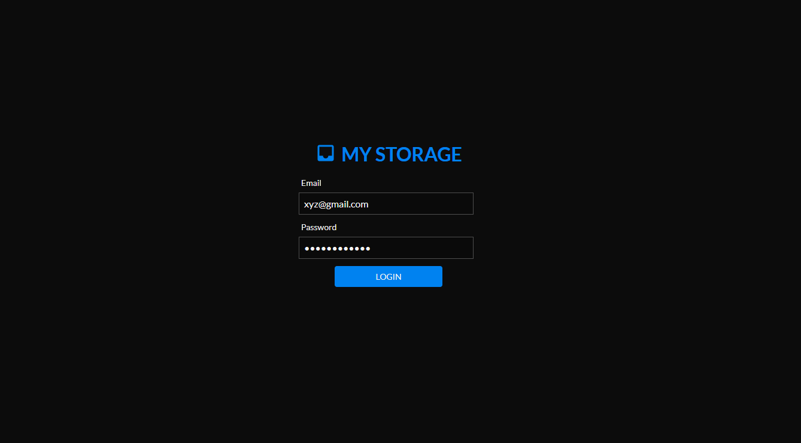
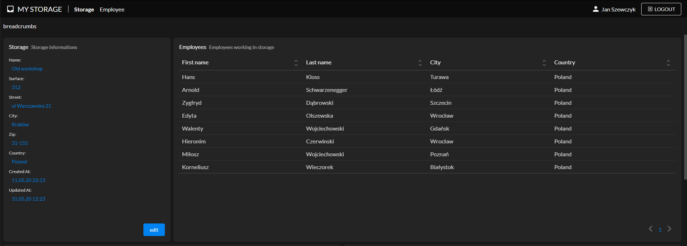
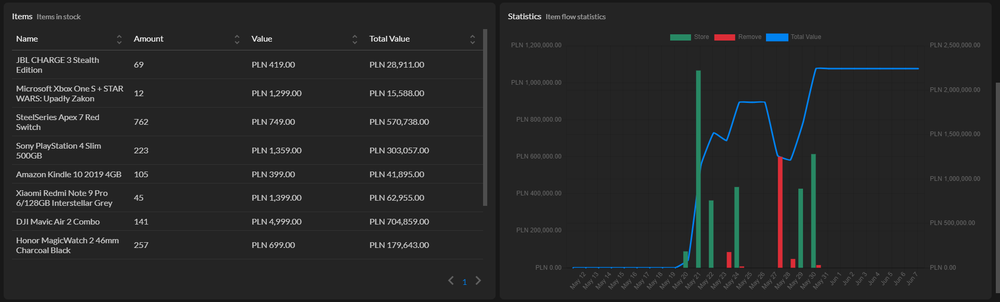
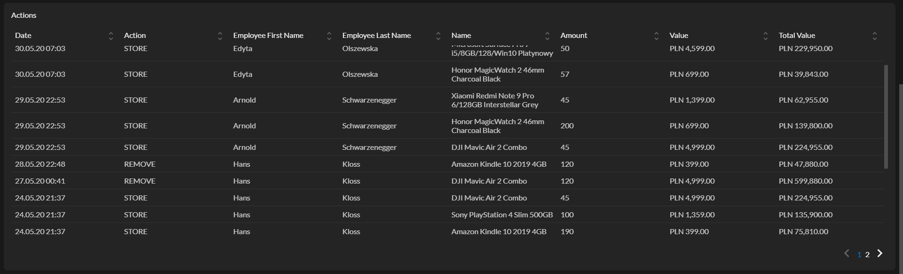

# My Storage 

My Storage, client application

My Storage is an application for warehouse management. Allows you to create a 
certain number of warehouses assigned to owners who can employ and create employees 
assigned to the warehouse.

## Project Status

This project is currently in development. Users can log in to create storage, hire
 employees and create and edit their accounts, view storage work statistics.

## Project Screen Shots

### Login page

### Storage Page

## Installation and Setup Instructions

Clone down this repository. You will need `node` and `npm` installed globally on your machine.  

Installation:

`npm install`  

To Run Test Suite:  

`npm test`  

To Start Server:

`npm start`  

To Visit App:

`localhost:3000`
